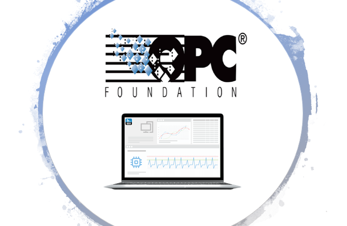

# Server OPC UA PC & Monitoring 

## About this project

Within the framework of the **Industrial Data Capture & Publish project**, I developed this opc ua server with nodejs so that it can be 
multiplatform in order to monitor our Industrial PCs remotely.
This server makes available (using the **OPC UA** standard) the hardware and software information of the machine, 
e.g. serial number, manufacturer's name, installed software and patches.

I made this project based on the open source project that you can find [here](https://github.com/node-opcua/node-opcua)

## Setting up :

You will find in the folder, two scripts:
- Start by running the "node get-userN-wmic-test.js" script (this one allows you to copy or create the openssl folder in
	C:\n-Users, Admin, Local Programs..;

- Next, run the "node server-opcua-nodejs-monitoringpc.js" (our opc ua server) ;
- Make sure that the following message is present in your terminal :

	initialized
	Server is now listening ... ( press CTRL+C to stop)
	port 4334
 	the primary server endpoint url is opc.tcp://xxx:4334

- Now your server is working properly... Connect to its url address with unclient opc ua such as 
UAExpert to be able to exploit its data.

### P.S: openssl is the tool that allows to distribute and/or manage certificate keys between the client and the server.
